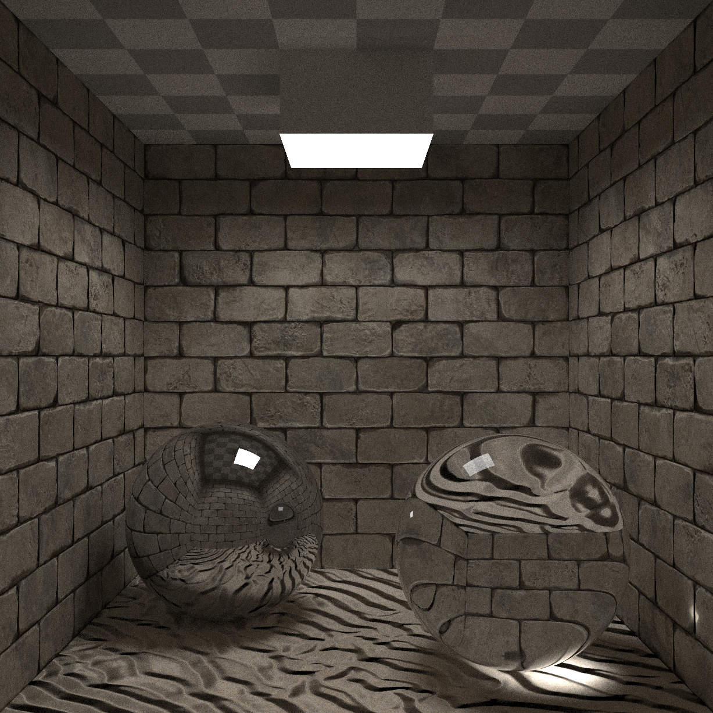
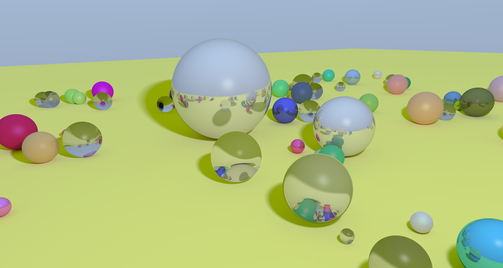

# Projet Raytracing HAI719I - Gilles GONZALEZ OROPEZA


Générateur d'images par lancer de rayons

# Fonctionnalités

- Objets géométriques : sphères, plans
- Maillages de triangles
- Matériaux : lambertien, miroir, transparent, lumineux
- Textures : images, damier, maillage colorés par sommets ou par faces, texture du ciel
- Normal maps
- KD-Tree et multithreading pour accélérer le rendu
- Flou de mouvement

# Utilisation
Dépendance nécessaire : OpenGL

#### Compilation et exécution

```bash
make && ./main
```

#### Contrôles

- r : rendre une image par lancer de rayons de la scène courante
- \- / + : changer de scène
- Clic gauche + déplacement : rotation de la caméra
- Clic droit + déplacement : translation de la caméra
- Clic molette + déplacement : zoom de la caméra
- s / S : diminuer / augmenter le nombre de rayons lancés par pixel
- f : mode plein écran
- u : régénérer la scène des sphères aléatoire avec une nouvelle graine
- q, ESC : quitter

# Exemples






